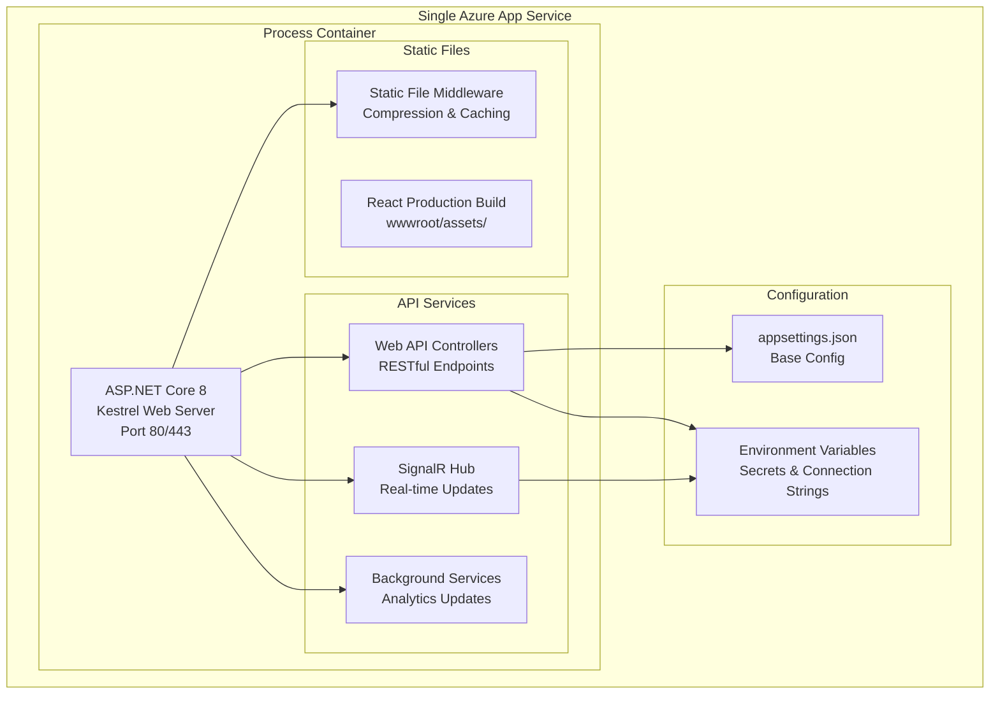
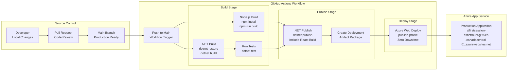
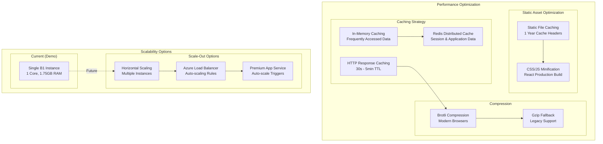
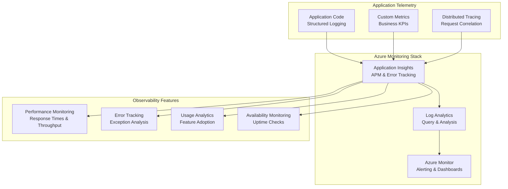
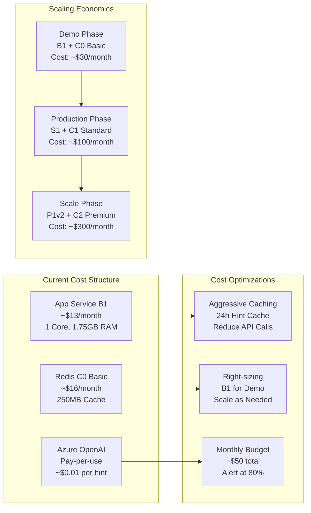
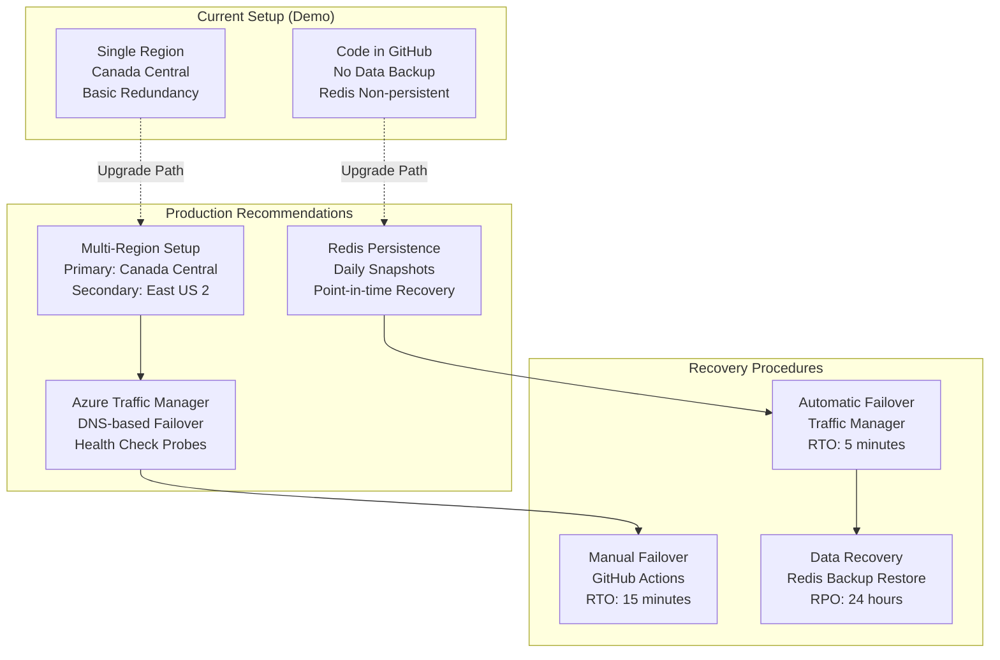

# Hosting & Infrastructure Architecture

This document outlines the hosting and infrastructure architecture for the AI-First Demo application deployed on Microsoft Azure.

## Azure Infrastructure Overview

```mermaid
graph TB
    subgraph "Internet"
        Users[Users<br/>Global Internet Access]
        CDN[Azure CDN<br/>(Optional)<br/>Static Asset Delivery]
    end
    
    subgraph "Azure Canada Central Region"
        subgraph "App Service Plan"
            AppService[Azure App Service<br/>Linux B1 Basic<br/>Single Instance]
        end
        
        subgraph "Managed Services"
            Redis[Azure Cache for Redis<br/>C0 Basic 250MB<br/>Non-persistent]
            OpenAI[Azure OpenAI Service<br/>GPT-3.5-turbo<br/>Pay-per-use]
        end
        
        subgraph "Monitoring & Logging"
            AppInsights[Application Insights<br/>Performance Monitoring]
            LogAnalytics[Log Analytics Workspace<br/>Centralized Logging]
        end
    end
    
    subgraph "Development & Deployment"
        GitHub[GitHub Repository<br/>Source Control]
        Actions[GitHub Actions<br/>CI/CD Pipeline]
        LocalDev[Local Development<br/>Docker Redis + .NET]
    end
    
    Users --> CDN
    CDN --> AppService
    Users --> AppService
    
    AppService --> Redis
    AppService --> OpenAI
    AppService --> AppInsights
    AppInsights --> LogAnalytics
    
    GitHub --> Actions
    Actions --> AppService
    LocalDev --> GitHub
```

## Application Deployment Architecture



## CI/CD Pipeline Architecture



## Network & Security Architecture

```mermaid
graph TB
    subgraph "Internet Boundary"
        Internet[Public Internet<br/>Global Users]
        Firewall[Azure Firewall<br/>DDoS Protection]
    end
    
    subgraph "Azure App Service"
        subgraph "Application Security"
            HTTPS[HTTPS Termination<br/>TLS 1.2+ Only]
            CORS[CORS Policy<br/>Dynamic Origin Validation]
            RateLimit[Rate Limiting<br/>IP-based Quiz Limits]
        end
        
        subgraph "Authentication"
            SessionAuth[Session-based Auth<br/>Redis Session Store]
            IPTracking[IP Address Tracking<br/>SHA-256 Hashed]
        end
    end
    
    subgraph "Data Security"
        subgraph "Secrets Management"
            EnvVars[Environment Variables<br/>Azure App Service Config]
            KeyVault[Azure Key Vault<br/>(Future Enhancement)]
        end
        
        subgraph "Data Protection"
            RedisSSL[Redis SSL/TLS<br/>Encrypted in Transit]
            OpenAIHTTPS[OpenAI HTTPS<br/>API Key Authentication]
        end
    end
    
    Internet --> Firewall
    Firewall --> HTTPS
    HTTPS --> CORS
    CORS --> RateLimit
    RateLimit --> SessionAuth
    
    SessionAuth --> EnvVars
    SessionAuth --> RedisSSL
    SessionAuth --> OpenAIHTTPS
```

## Performance & Scalability Architecture



## Monitoring & Observability



## Cost Optimization Strategy



## Disaster Recovery & Business Continuity



## Key Infrastructure Decisions

### 1. Single App Service Deployment
- React SPA and .NET API in one container
- Simplified deployment and management
- Cost-effective for demo scenarios
- Easy to scale out when needed

### 2. Azure-Native Services
- Azure Cache for Redis for simplicity
- Azure OpenAI for AI capabilities
- Application Insights for monitoring
- Leverages Azure's managed service benefits

### 3. GitHub Actions CI/CD
- Simple workflow with build, test, and deploy
- Secrets managed in GitHub repository
- Zero-downtime deployments
- Easy to trigger and monitor

### 4. Cost-Optimized Configuration
- B1 App Service plan for demos
- C0 Redis for development workloads
- Pay-per-use OpenAI for variable costs
- ~$30/month total running cost

### 5. Security-First Approach
- HTTPS-only communication
- Environment variables for secrets
- CORS policies for API protection
- Rate limiting for abuse prevention

This infrastructure provides a solid foundation for the demo while maintaining clear upgrade paths for production scenarios. 