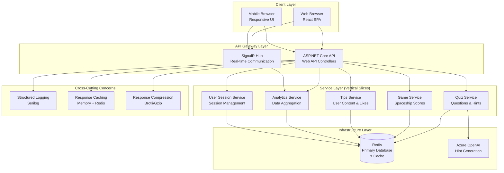
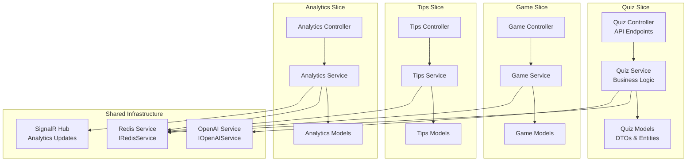
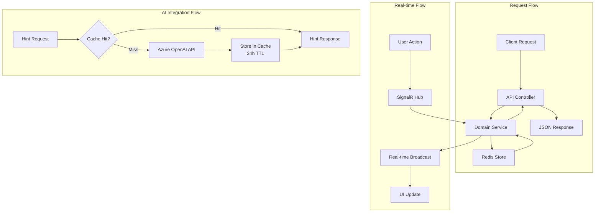
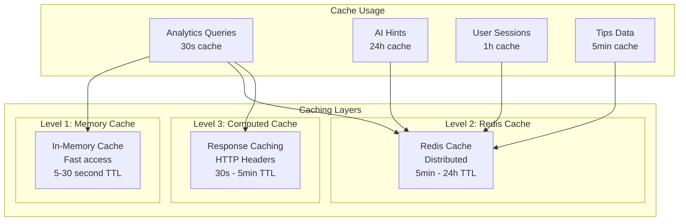
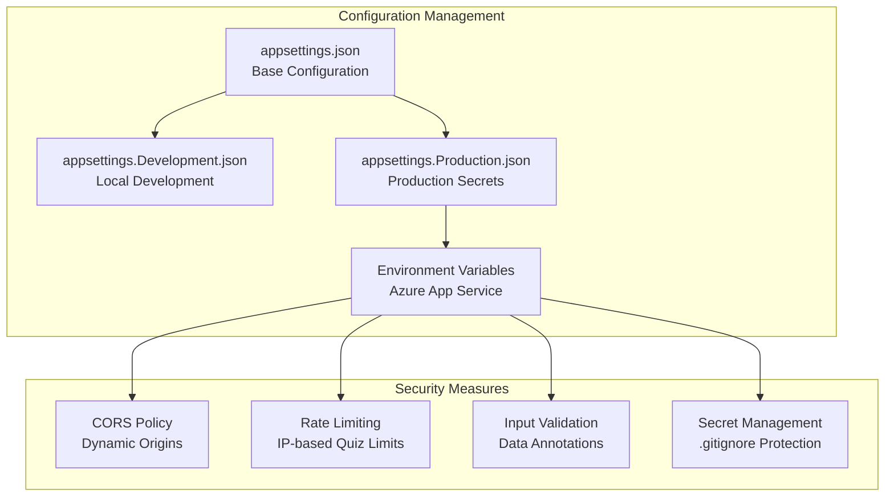
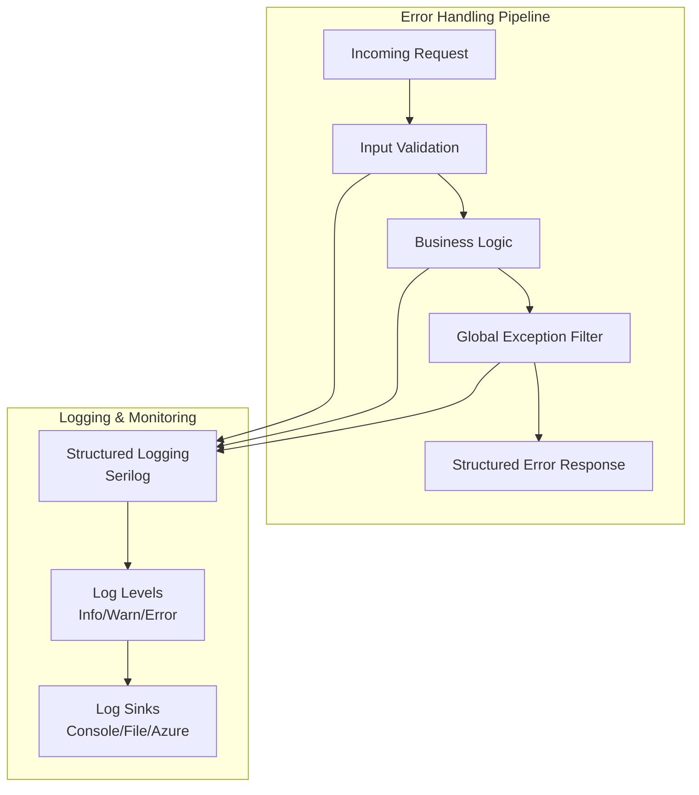

# Solution Architecture

This document outlines the backend solution architecture for the AI-First Demo application.

## Overall Solution Architecture



## Service Layer Architecture (Vertical Slices)



## Data Flow Architecture



## Redis Data Patterns

```mermaid
graph LR
    subgraph "Redis Key Patterns"
        subgraph "User Sessions"
            US[session:{sessionId}<br/>User session data]
            UIP[ip:{ipHash}<br/>IP tracking]
        end
        
        subgraph "Quiz Data"
            QA[quiz:attempts:{ipHash}<br/>Quiz attempts count]
            QR[quiz:results:{sessionId}<br/>Quiz results]
            QH[quiz:hints:{questionId}<br/>Cached AI hints]
        end
        
        subgraph "Game Data"
            GS[game:scores<br/>Sorted set of scores]
            GP[game:player:{sessionId}<br/>Player game data]
        end
        
        subgraph "Tips Data"
            T[tips:{tipId}<br/>Tip content]
            TC[tips:category:{category}<br/>Tips by category]
            TL[tips:likes:{tipId}<br/>Tip like count]
            UL[user:likes:{sessionId}<br/>User's liked tips]
        end
        
        subgraph "Analytics Cache"
            AQ[analytics:quiz<br/>Cached quiz stats]
            AG[analytics:game<br/>Cached game stats]
            AT[analytics:tips<br/>Cached tips stats]
        end
    end
```

## Performance & Caching Strategy



## Security & Configuration



## Error Handling & Monitoring



## Key Architecture Decisions

### 1. Service Layer Pattern (Not CQRS)
- Direct service injection for simplicity
- Business logic encapsulated in domain services
- Clean separation between controllers and business logic

### 2. Redis as Primary Database
- Single data store for simplicity
- Built-in caching capabilities
- Excellent performance for demo scenarios

### 3. Vertical Slice Architecture
- Features organized as self-contained slices
- Each slice owns its controllers, services, and models
- Shared infrastructure services for cross-cutting concerns

### 4. Performance-First Design
- Multiple caching layers (memory, Redis, HTTP)
- Response compression (Brotli/Gzip)
- Optimized query patterns and data structures

### 5. AI Integration Strategy
- Cost-optimized with 24-hour hint caching
- Fallback mechanisms for AI service failures
- Smart hint exclusion for difficult questions

This architecture balances simplicity, performance, and maintainability while demonstrating modern .NET development practices. 