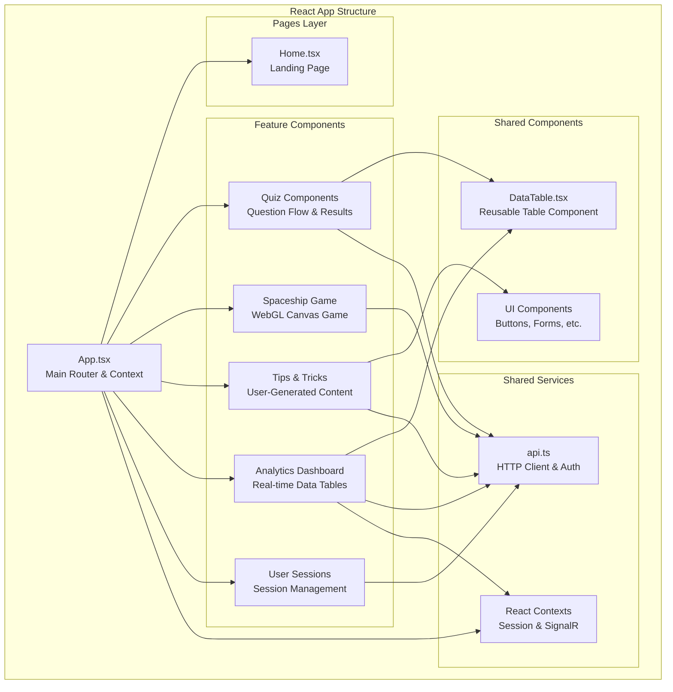
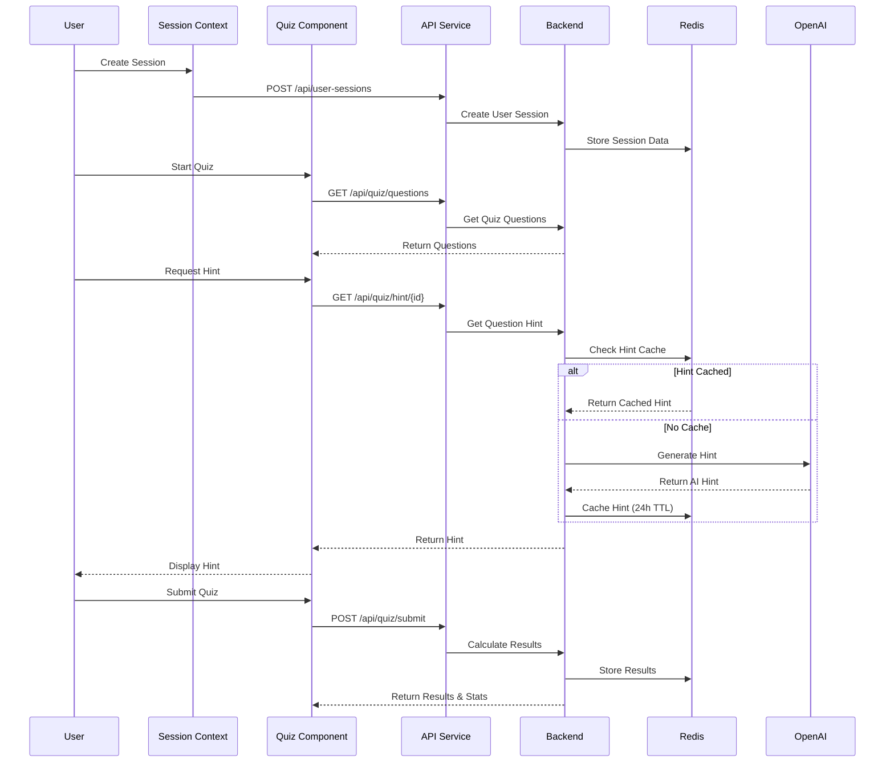
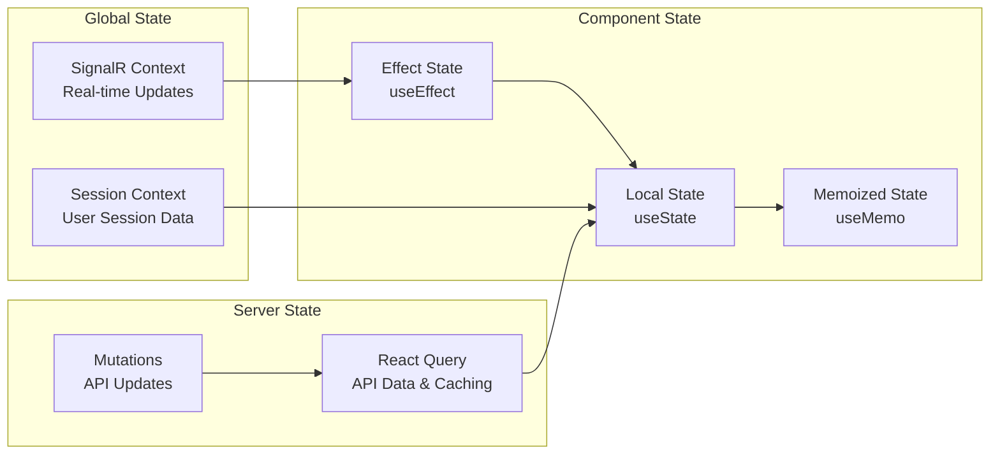
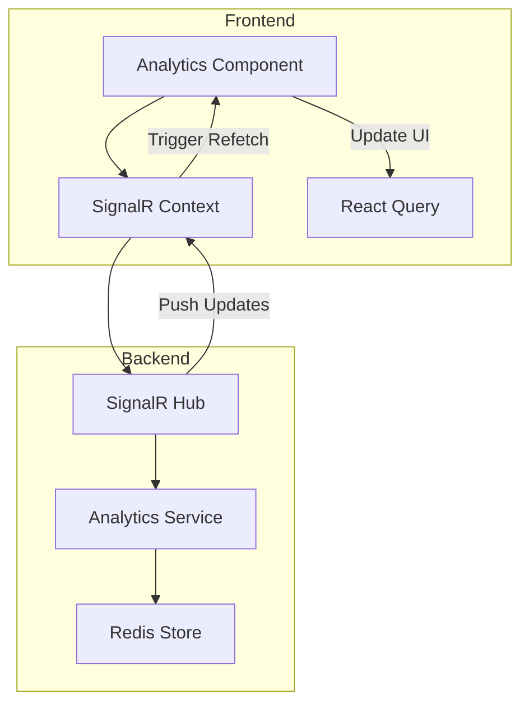

# UI Component Architecture

This document outlines the user interface component architecture for the AI-First Demo application.

## Frontend Architecture Overview

## Component Interaction Flow

## State Management Pattern

## Key Design Principles

### 1. Feature-Based Organization
- Components organized by feature domain (quiz, game, tips, analytics)
- Each feature has its own components, services, and types
- Shared components for common UI patterns

### 2. React Query for Server State
- Intelligent caching with appropriate stale times
- Optimistic updates for better UX
- Error handling and retry logic

### 3. Context for Global State
- Session context for user authentication state
- SignalR context for real-time updates
- Minimal global state, prefer local component state

### 4. Performance Optimizations
- `React.memo` for expensive components
- `useMemo` for computed values
- `useCallback` for stable function references
- Strategic lazy loading where appropriate

## Component Responsibilities

| Component | Responsibility |
|-----------|----------------|
| **App.tsx** | Main router, context providers, global layout |
| **Quiz Components** | Question flow, hint system, results display |
| **Game Component** | WebGL spaceship game with scoring |
| **Tips Components** | User-generated tips with like/unlike functionality |
| **Analytics Components** | Real-time data tables with sorting/filtering |
| **DataTable** | Reusable table with TanStack Table integration |
| **Session Context** | User session management and persistence |
| **SignalR Context** | Real-time updates from backend |
| **API Service** | HTTP client with authentication and error handling |

## Real-Time Updates Architecture

This architecture ensures efficient real-time updates while maintaining good separation of concerns and performance. 